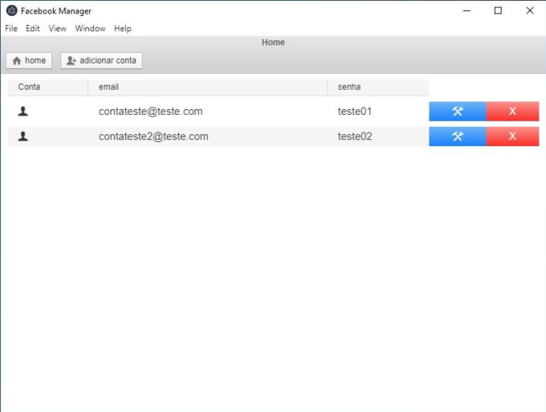

# Facebook Manager

**Automação de Facebook**

Esse projeto foi criado com o intuito de ajudar profissionais ou usuários comuns que usam do Facebook como instrumento de trabalho, automatizando tarefas trabalhosas, na configuração e adicionando alguns recursos que não são disponibilizados no próprio sistema do Facebook, o programa foi projetado para ser de simples uso, pra isso póssui uma interface limpa e coesa para que se tenha uma experiência de uso agrádavel.

**Algumas Funções São: **
- `Delete todas as Fotos de seu Facebook` - O bot vai fazer procurar e limpeza de todas as suas imagens do facebook, incluido as que não são excluidas por extenções comumente usadas.
- `Delete todos os Álbuns de seu Facebook` - O bot vai fazer procurar e limpeza de todos os álbuns armazenados no facebook, incluido os que não são excluidos por extenções comumente usadas, como o álbum de dispositivos móveis, e álbuns ocultos.
- `Automatizar Configuração de Privacidade da conta` - O bot vai automatizar o processo de configuração da privacidade em sua conta, de acordo com a configuração que você escolheu previamente no programa.
- `Automatizar Adicionar Novo Nome` - O bot vai automatizar o processo de configuração onde se adiciona um novo nome de usuário a conta, de acordo com a configuração que você escolheu previamente no programa, inclusive existe a possibilidade de mudar seu nome através do formulário da página de ajuda do Facebook, enviando um documento para o Sistema.
- `Automatizar Adicionar Telefone` - O bot vai automatizar o processo de configuração onde se adiciona um novo telefone a sua conta, configurável, totalmente atráves da interface do programa.
- `Automatizar Baixar Dados da Conta` - O bot vai automatizar o processo de configuração onde se baixa os dados de sua conta, podendo escolher o formato a ser baixado na interface.

## Para usar caso seja um desenvolvedor

Clone esse repositório, vá para a pasta de arquivos do programa, e digite no terminal **npm install**, e logo após **npm start**, isso vai iniciar a interface do programa.

